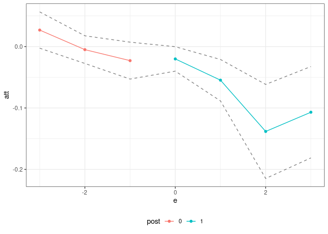

<!-- README.md is generated from README.Rmd. Please edit that file -->

# Panel Treatment Effects (pte) Package

The `pte` package compartmentalizes the steps needed to implement
estimators of group-time average treatment effects (and their
aggregations) in order to make it easier to apply the same sorts of
arguments outside of their “birthplace” in the literature on
difference-in-differences.

This code is lightweight, only works for balanced panels, and has
minimal error checking. That said, it should be useful projects that
build on top of group-time average treatment effects in order to deliver
estimates of causal effects in panel data settings.

The main function is called `pte`. The most important paramters that it
takes in are `subset_fun` and `attgt_fun`. These are functions that the
user should pass to `pte`.

`subset_fun` takes in the overall data, a group, a time period, and
possibly other arguments and returns a `data.frame` containing the
relevant subset of the data, an outcome, and whether or not a unit
should be considered to be in the treated or comparison group for that
group/time. There is one example of a relevant subset function provided
in the package: [the `two_by_two_subset`
function](https://github.com/bcallaway11/pte/blob/master/R/subset_functions.R).
This function takes an original dataset, subsets it into pre- and
post-treatment periods and denotes treated and untreated units. This
particular subset is perhaps the most common/important one for thinking
about treatment effects with panel data.

The other main function is `attgt_fun`. This function should be able to
take in the correct subset of data, possibly along with other arguments
to the function, and report an *ATT* for that subset. With minor
modification, this function should be availble for most any sort of
treatment effects application — for example, if you can solve the
baseline 2x2 case in difference in differences, you should use that
function here, and the `pte` package will take care of dealing with the
variation in treatment timing.

If `attgt_fun` returns an influence function, then the `pte` package
will also conduct inference using the multiplier bootstrap (which is
fast) and produce uniform confidence bands (which adjust for multiple
testing).

The default output of `pte` is an overall treatment effect on the
treated (i.e., across all groups that participate in the treatment in
any time period) and dynamic effects (i.e., event studies). More
aggregations are possible, but these seem to be the leading cases;
aggregations of group-time average treatment effects are discussed at
length in [Callaway and Sant’Anna
(2021)](https://doi.org/10.1016/j.jeconom.2020.12.001).

Here are a few examples:

## Example 1: Difference in differences

The [`did` package](https://bcallaway11.github.io/did/), which is based
on [Callaway and Sant’Anna
(2021)](https://doi.org/10.1016/j.jeconom.2020.12.001), includes
estimates of group-time average treatment effects, *ATT(g,t)*, based on
a difference in differences identification strategy. The following
example demonstrates that it is easy to compute group-time average
treatment effects using difference in differences using the `pte`
package. \[*Note:* This is definitely not the recommended way of doing
this as there is very little error handling, etc. here, but it is rather
a proof of concept. You should use the `did` package for this case.\]

This example reproduces DID estimates of the effect of the minimum wage
on employment using data from the `did` package.

``` r
library(did)
data(mpdta)
did_res <- pte(yname="lemp",
               gname="first.treat",
               tname="year",
               idname="countyreal",
               data=mpdta,
               setup_pte_fun=setup_pte,
               subset_fun=two_by_two_subset,
               attgt_fun=did_attgt,
               xformla=~lpop) 

summary(did_res)
#> 
#> Overall ATT:  
#>      ATT    Std. Error     [ 95%  Conf. Int.]  
#>  -0.0323        0.0111    -0.0541     -0.0104 *
#> 
#> 
#> Dynamic Effects:
#>  Event Time Estimate Std. Error   [95%  Conf. Band]  
#>          -3   0.0269     0.0121 -0.0036      0.0574  
#>          -2  -0.0050     0.0131 -0.0381      0.0282  
#>          -1  -0.0229     0.0150 -0.0607      0.0149  
#>           0  -0.0201     0.0114 -0.0488      0.0086  
#>           1  -0.0547     0.0167 -0.0969     -0.0126 *
#>           2  -0.1382     0.0346 -0.2256     -0.0507 *
#>           3  -0.1069     0.0376 -0.2019     -0.0119 *
#> ---
#> Signif. codes: `*' confidence band does not cover 0
ggpte(did_res)
```

<!-- -->

What’s most interesting here, is that the only “new” code that needs to
be writte is in [the `did_attgt`
function](https://github.com/bcallaway11/pte/blob/master/R/attgt_functions.R).
You will see that this is a very small amount of code.

## Example 2: Policy Evaluation during a Pandemic

As a next example, consider trying to estimate effects of Covid-19
related policies during a pandemic. The estimates below are for the
effects of state-leve shelter-in-place orders during the early part of
the pandemic.

[Callaway and Li (2021)](https://arxiv.org/abs/2105.06927) argue that a
particular unconfoundedness-type strategy is more appropriate in this
context than DID-type strategies due to the spread of Covid-19 cases
being highly nonlinear. However, they still deal with the challenge of
variation in treatment timing. Therefore, it is still useful to think
about group-time average treatment effects, but the DID strategy should
be replaced with their particular unconfoundedness type assumption.

The `pte` package is particularly useful here.

``` r
# formula for covariates
xformla <- ~ current + I(current^2) + region + totalTestResults
```

``` r
covid_res <- pte(yname="positive",
                 gname="group",
                 tname="time.period",
                 idname="state_id",
                 data=covid_data2,
                 setup_pte_fun=setup_pte_basic,
                 subset_fun=two_by_two_subset,
                 attgt_fun=covid_attgt,
                 xformla=xformla,
                 max_e=21,
                 min_e=-10) 
#> Warning in compute.aggte(MP = MP, type = type, balance_e = balance_e, min_e =
#> min_e, : Simultaneous conf. band is somehow smaller than pointwise one using
#> normal approximation. Since this is unusual, we are reporting pointwise
#> confidence intervals

summary(covid_res)
#> 
#> Overall ATT:  
#>      ATT    Std. Error     [ 95%  Conf. Int.] 
#>  14.8882       83.8907  -149.5347     179.311 
#> 
#> 
#> Dynamic Effects:
#>  Event Time Estimate Std. Error     [95%  Conf. Band] 
#>         -10  -3.7266     3.8545  -14.3422      6.8889 
#>          -9   2.6607     1.6804   -1.9672      7.2886 
#>          -8   0.8290     2.1834   -5.1843      6.8422 
#>          -7   5.2843     2.5252   -1.6703     12.2390 
#>          -6   2.8555     2.0553   -2.8050      8.5160 
#>          -5   1.3589     4.8250  -11.9293     14.6471 
#>          -4   0.3294     4.4997  -12.0631     12.7219 
#>          -3  -4.2227     5.5764  -19.5802     11.1349 
#>          -2  -3.8447     2.6764  -11.2157      3.5263 
#>          -1  -0.2234     4.1228  -11.5778     11.1310 
#>           0 -10.8156     7.4650  -31.3747      9.7434 
#>           1 -13.7998    14.9400  -54.9455     27.3458 
#>           2  -7.8432    12.4921  -42.2471     26.5608 
#>           3  -4.5541     9.7413  -31.3821     22.2738 
#>           4  -3.5368    12.2911  -37.3872     30.3136 
#>           5   8.5221    13.1051  -27.5701     44.6143 
#>           6   1.1140    15.0092  -40.2220     42.4500 
#>           7   6.6384    23.7749  -58.8389     72.1158 
#>           8   7.1288    27.8035  -69.4435     83.7011 
#>           9  10.8758    26.7418  -62.7725     84.5241 
#>          10  17.5057    30.7139  -67.0821    102.0935 
#>          11  40.8318    41.3370  -73.0124    154.6760 
#>          12  48.6134    56.0856 -105.8492    203.0759 
#>          13  52.4228    55.8698 -101.4455    206.2911 
#>          14  50.2000    48.6461  -83.7737    184.1738 
#>          15  68.2960    58.0243  -91.5059    228.0980 
#>          16  44.7305    63.8813 -131.2018    220.6629 
#>          17  61.4670    82.5996 -166.0166    288.9506 
#>          18  50.4635   107.8083 -246.4461    347.3731 
#>          19  47.3392   116.1415 -272.5204    367.1987 
#>          20  28.6326   152.9542 -392.6110    449.8763 
#>          21   4.3445   129.9832 -353.6357    362.3248 
#> ---
#> Signif. codes: `*' confidence band does not cover 0
ggpte(covid_res) + ylim(c(-1000,1000))
```

<!-- -->

What’s most interesting is just how little code needs to be written
here. The only new code required is the `ppe::covid_attgt` function
which is [available
here](https://github.com/bcallaway11/ppe/blob/master/R/covid_attgt.R),
and, as you can see, this is very simple.

## Example 3: Empirical Bootstrap

The code above used the multiplier bootstrap. The great thing about the
multiplier bootstrap is that it’s fast. But in order to use it, you have
to work out the influence function for the estimator of *ATT(g,t)*.
Although I pretty much always end up doing this, it can be tedious, and
it can be nice to get a working version of the code for a project going
before working out the details on the influence function.

The `pte` package can be used with the empirical bootstrap. There are a
few limitations. First, it’s going to be substantially slower. Second,
this code just reports pointwise confidence intervals. However, this
basically is set up to fit into my typical workflow, and I see this as a
way to get preliminary results.

Let’s demonstrate it. To do this, consider the same setup as in Example
1, but where no influence function is returned. Let’s write the code for
this:

``` r
# did with no influence function
did_attgt_noif <- function(gt_data, xformla, ...) {

  # call original function
  did_gt <- did_attgt(gt_data, xformla, ...)

  # remove influence function
  did_gt$inf_func <- NULL

  did_gt
}
```

Now, we can show the same sorts of results as above

``` r
did_res_noif <- pte(yname="lemp",
                    gname="first.treat",
                    tname="year",
                    idname="countyreal",
                    data=mpdta,
                    setup_pte_fun=setup_pte,
                    subset_fun=two_by_two_subset,
                    attgt_fun=did_attgt_noif, #this is only diff.
                    xformla=~lpop) 

summary(did_res_noif)
#> 
#> Overall ATT:  
#>      ATT    Std. Error     [ 95%  Conf. Int.]  
#>  -0.0323        0.0137     -0.059     -0.0055 *
#> 
#> 
#> Dynamic Effects:
#>  Event Time Estimate Std. Error [95% Pointwise  Conf. Band]  
#>          -3   0.0269     0.0133          0.0009      0.0529 *
#>          -2  -0.0050     0.0131         -0.0306      0.0207  
#>          -1  -0.0229     0.0166         -0.0555      0.0097  
#>           0  -0.0201     0.0130         -0.0455      0.0052  
#>           1  -0.0547     0.0176         -0.0893     -0.0202 *
#>           2  -0.1382     0.0378         -0.2122     -0.0642 *
#>           3  -0.1069     0.0338         -0.1732     -0.0406 *
#> ---
#> Signif. codes: `*' confidence band does not cover 0
ggpte(did_res_noif)
```

<!-- -->

What’s exciting about this is just how little new code needs to be
written.
