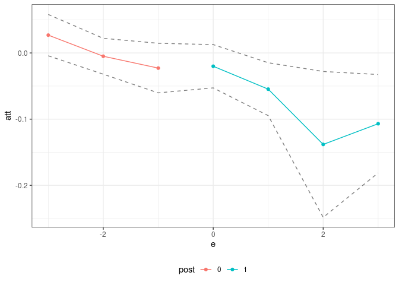
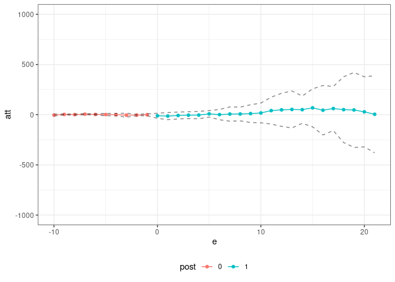

<!-- README.md is generated from README.Rmd. Please edit that file -->

# Panel Treatment Effects (pte) Package

The `pte` package compartmentalizes the steps needed to implement
estimators of group-time average treatment effects (and their
aggregations) in order to make it easier to apply the same sorts of
arguments outside of their “birthplace” in the literature on
difference-in-differences.

This code is lightweight, only works for balanced panels, and has
minimal error checking. That said, it should be useful projects that
build on top of group-time average treatment effects in order to deliver
estimates of causal effects in panel data settings.

Here are a couple of examples:

## Example 1: Difference in differences

The [`did` package](https://bcallaway11.github.io/did/) includes
estimates of group-time average treatment effects, \(ATT(g,t)\), based
on a difference in differences identification strategy. The following
example demonstrates that it is easy to compute group-time average
treatment effects using difference in differences using the `pte`
package. \[*Note:* This is definitely not the recommended way of doing
this (as there is very little error handling, etc. here), but it is
rather a proof of concept.\]

``` r
library(did)
data(mpdta)
did_res <- pte(yname="lemp",
           gname="first.treat",
           tname="year",
           idname="countyreal",
           data=mpdta,
           subset_fun=two_by_two_subset,
           attgt_fun=did_attgt,
           xformla=~lpop) 

summary(did_res)
#> 
#> Overall ATT:  
#>      ATT    Std. Error     [ 95%  Conf. Int.]  
#>  -0.0323        0.0137     -0.059     -0.0055 *
#> 
#> 
#> Dynamic Effects:
#>  Event Time Estimate Std. Error   [95%  Conf. Band]  
#>          -3   0.0269     0.0132 -0.0063      0.0602  
#>          -2  -0.0050     0.0133 -0.0386      0.0287  
#>          -1  -0.0229     0.0181 -0.0685      0.0228  
#>           0  -0.0201     0.0111 -0.0482      0.0079  
#>           1  -0.0547     0.0162 -0.0956     -0.0139 *
#>           2  -0.1382     0.0385 -0.2353     -0.0411 *
#>           3  -0.1069     0.0358 -0.1972     -0.0166 *
#> ---
#> Signif. codes: `*' confidence band does not cover 0
ggpte(did_res)
```

<!-- --> What’s most
interesting here, is that the only “new” code that needs to be writte is
in the `did_attgt` function [available
here](https://github.com/bcallaway11/pte/blob/master/R/attgt_functions.R).
You will see that this is a very small amount of code.

## Example 2: Policy Evaluation during a Pandemic

As a next example, consider trying to estimate effects of Covid-19
related policies during a pandemic (the estimates below are for the
effects of state-leve shelter-in-place orders during the early part of
the pandemic).

Callaway and Li (2021) argue that a particular unconfoundedness-type
strategy is more appropriate in this context than DID-type strategies
due to the spread of Covid-19 cases being highly nonlinear. However,
they still deal with the challenge of variation in treatment timing.
Therefore, it is still useful to think about group-time average
treatment effects, but the DID strategy should be replaced with their
particular unconfoundedness type assumption.

The `pte` package is particularly useful here.

``` r
# formula for covariates
xformla <- ~ current + I(current^2) + region + totalTestResults
```

``` r
covid_res <- pte(yname="positive",
                 gname="group",
                 tname="time.period",
                 idname="state_id",
                 data=covid_data2,
                 subset_fun=two_by_two_subset,
                 attgt_fun=covid_attgt,
                 xformla=xformla,
                 max_e=21,
                 min_e=-10) 

summary(covid_res)
#> 
#> Overall ATT:  
#>      ATT    Std. Error     [ 95%  Conf. Int.] 
#>  14.8882       74.9824  -132.0746    161.8509 
#> 
#> 
#> Dynamic Effects:
#>  Event Time Estimate Std. Error     [95%  Conf. Band] 
#>         -10  -3.7266     3.7679  -14.0196      6.5663 
#>          -9   2.6607     1.7434   -2.1019      7.4232 
#>          -8   0.8290     2.8265   -6.8922      8.5501 
#>          -7   5.2843     2.3024   -1.0053     11.5740 
#>          -6   2.8555     1.8870   -2.2992      8.0102 
#>          -5   1.3589     3.4921   -8.1806     10.8985 
#>          -4   0.3294     4.0894  -10.8419     11.5006 
#>          -3  -4.2227     5.5966  -19.5110     11.0657 
#>          -2  -3.8447     2.7082  -11.2427      3.5532 
#>          -1  -0.2234     3.6777  -10.2699      9.8231 
#>           0 -10.8156     8.8015  -34.8591     13.2278 
#>           1 -13.7998    15.6598  -56.5783     28.9786 
#>           2  -7.8432    10.6400  -36.9088     21.2225 
#>           3  -4.5541    10.5309  -33.3218     24.2135 
#>           4  -3.5368    15.3115  -45.3638     38.2902 
#>           5   8.5221    11.4969  -22.8845     39.9287 
#>           6   1.1140    19.3970  -51.8735     54.1015 
#>           7   6.6384    19.1366  -45.6377     58.9146 
#>           8   7.1288    28.9177  -71.8669     86.1244 
#>           9  10.8758    28.1257  -65.9562     87.7078 
#>          10  17.5057    32.1605  -70.3483    105.3597 
#>          11  40.8318    41.3817  -72.2123    153.8758 
#>          12  48.6134    48.0232  -82.5737    179.8004 
#>          13  52.4228    52.3926  -90.7003    195.5459 
#>          14  50.2000    61.0556 -116.5881    216.9882 
#>          15  68.2960    96.1981 -194.4924    331.0844 
#>          16  44.7305    86.0985 -190.4683    279.9293 
#>          17  61.4670   117.7683 -260.2455    383.1794 
#>          18  50.4635   113.6294 -259.9427    360.8697 
#>          19  47.3392   131.6992 -312.4289    407.1073 
#>          20  28.6326   106.5689 -262.4860    319.7512 
#>          21   4.3445   144.4024 -390.1255    398.8146 
#> ---
#> Signif. codes: `*' confidence band does not cover 0
ggpte(covid_res) + ylim(c(-1000,1000))
```

<!-- -->

What’s most interesting is just how little code needs to be written
here. The only new code required is the `ppe::covid_attgt` function
which is [available
here](https://github.com/bcallaway11/ppe/blob/master/R/covid_attgt.R),
and, as you can see, this is very simple.
